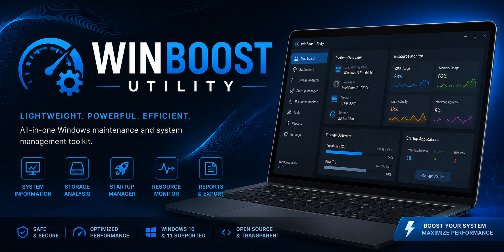
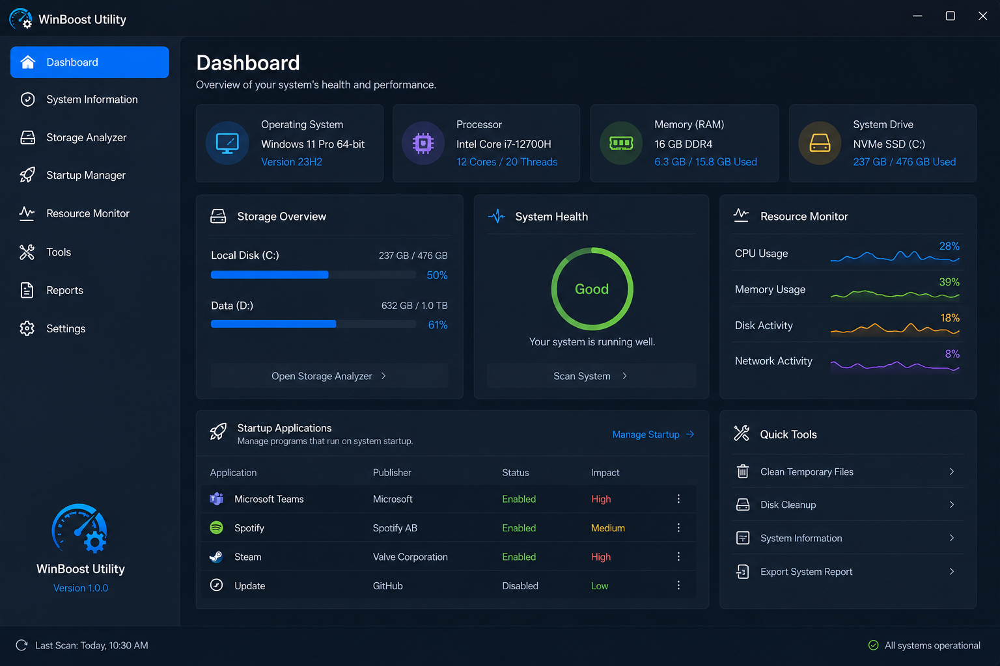

# WinBoost-Utility
Lightweight Windows maintenance and system management toolkit with storage insights, startup control, resource monitoring, and reporting features.

# WinBoost Utility

  

  Lightweight Windows maintenance and system management toolkit.

  
  
  
  

---

## Overview

WinBoost Utility is a lightweight desktop application that helps users review system information, analyze storage usage, monitor resources, and manage startup applications through a clean interface.

The project focuses on simplicity, transparency, and ease of use.

---

## Features

### System Information

* Operating System Details
* Hardware Overview
* Processor Information
* Memory Information

### Storage Analysis

* Drive Overview
* Available Space Monitoring
* Storage Reports
* Exportable Summaries

### Startup Management

* View Startup Applications
* Enable or Disable Entries
* Startup Impact Overview

### Resource Monitoring

* CPU Usage
* Memory Usage
* Disk Activity
* Real-Time Statistics

### Reports

* Export System Reports
* Save Diagnostic Information
* Generate Summary Files

---

## Screenshots

### Main Dashboard

---

## Installation

1. Download the latest release.
2. Extract the ZIP archive.
3. Launch WinBoostUtility.exe.
4. Follow the on-screen instructions.

---

## Project Structure

WinBoost-Utility/

├── src/

├── assets/

├── release/

├── README.md

├── LICENSE

└── CHANGELOG.md

---

## Requirements

* Windows 10
* Windows 11
* .NET Runtime

---

## License

MIT License

---

## Disclaimer

This project is intended for educational and utility purposes. Users are responsible for reviewing any system changes before applying them.

---

## Support

If you find this project useful, consider starring the repository and sharing feedback through GitHub Issues.
